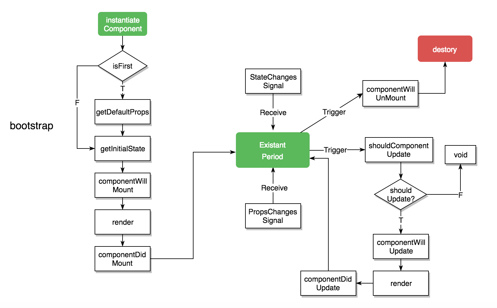
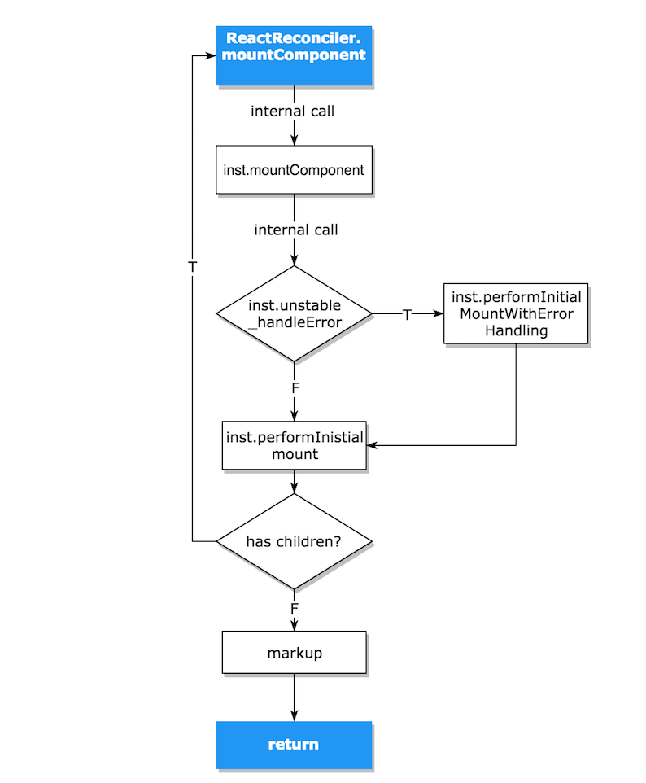

### §2.1 React的生命周期

#### §2.1.1 React生命周期过程

​	在ReactCompositeComponent.js里有这样一段注释, 清楚的解释了React的生命周期.

```typescript
/**
 * ------------------ The Life-Cycle of a Composite Component ------------------
 *
 * - constructor: Initialization of state. The instance is now retained.
 *   - componentWillMount
 *   - render
 *   - [children's constructors]
 *     - [children's componentWillMount and render]
 *     - [children's componentDidMount]
 *     - componentDidMount
 *
 *       Update Phases:
 *       - componentWillReceiveProps (only called if parent updated)
 *       - shouldComponentUpdate
 *         - componentWillUpdate
 *           - render
 *           - [children's constructors or receive props phases]
 *         - componentDidUpdate
 *
 *     - componentWillUnmount
 *     - [children's componentWillUnmount]
 *   - [children destroyed]
 * - (destroyed): The instance is now blank, released by React and ready for GC.
 *
 * -----------------------------------------------------------------------------
 */
```

​	相信对React有了解的同学都应该是知道的, 在React的Tutorial里有这样一个概念叫做**生命周期(Lifecycle)**, 在平时的开发过程中, 这个生命周期实际上也是经常用到, 比如**`componentDidMount`**, **`shouldComponentUpdate`**等钩子方法, 相信也有大部分人是看过下面这一张图:

 

#### §2.1.2 React生命周期函数介绍

React一共暴露了以下几个生命周期API:

**挂载阶段:** *这些方法在当一个组件的实例被创建与插入DOM节点期间调用*

* **constructor** <u>*在[instantiateReactComponent](https://github.com/JeremyWuuuuu/ReactSourceCodeNote/blob/master/Chapter1/Chapter%20%C2%A71.1%20-%20%C2%A71.23.md#123-%E8%87%AA%E5%AE%9A%E4%B9%89%E7%BB%84%E4%BB%B6%E7%9A%84%E5%AE%9E%E4%BE%8B%E5%8C%96)方法中调用*</u>
* **componentWillMount** 
* **render**
* **componentDidMount** *以上三个方法都是在[mountComponent](https://github.com/JeremyWuuuuu/ReactSourceCodeNote/blob/master/Chapter1/Chapter%20%C2%A71.24%20%E8%8A%82%E7%82%B9%E6%B8%B2%E6%9F%93.md#%E6%80%BB%E7%BB%93)方法里被调用*

**组件存在期: ** *这些方法在当组件的属性(props) 亦或是 状态(state) 发生改变时导致组件重新渲染时调用*

* **componentWillReceiveProps** *当**属性(props)**或者**状态(state)**发生改变时调用*
* **shouldComponentUpdate** *当上一个方法调用返回了**true**时调用*
* **render** *被上一个方法调用*
* **componentDidUpdate** *当render被调用结束后调用*

**组件销毁:**

* **componentWillUnmount** *当组件从节点中被移除时调用*

​        不难看出React组件的生命周期主要是**初始化(Instantiation Period)**阶段以及**存在期(Existant Period)**, 所以这里主要讲**Mount**以及**Update**过程中的调用, 由于React一共有四种不同的组件类型, 由于在第一章也讲过, 在React启动的过程中, 会把交到React手上挂载的组件通过包装包装成为一个**复合组件**来进行挂载, 所以在这里就以**复合组件(ReactCompositeComponent)**为例子讲解.

#### §2.1.3 挂载阶段(Mounting Period)

​	这个阶段实际上就是第一章的主要内容但是在这里把第一章里面没有具体讲到的内容作为补充, React应用启动需要经历该阶段, 而生命周期里的挂载阶段的三个钩子也是在这个阶段触发.

---

**Refer to:  [ReactCompositeComponent.js](https://github.com/facebook/react/blob/v15.6.2/src/renderers/shared/stack/reconciler/ReactCompositeComponent.js)**

---

##### **1)`<string>mountComponent`**

```typescript
// 中间省略一些开发环境的无关代码
var mountComponent = function(
    transaction,
    hostParent,
    hostContainerInfo,
    context,
  ) {
    this._context = context;
    this._mountOrder = nextMountID++;
    this._hostParent = hostParent;
    this._hostContainerInfo = hostContainerInfo;
	// 此处的this._currentElement实际上是真实的组件返回出来的ReactElement
    // 由于CompositeComponent会被React的CompositeComponentWrapper
    // 包装成为一个WrappedComponent而真实的组件被挂载在_currentElement上
    var publicProps = this._currentElement.props;
    var publicContext = this._processContext(context);

    var Component = this._currentElement.type;

    var updateQueue = transaction.getUpdateQueue();

    // Initialize the public class
    // 判断Component是否是无状态Component
    var doConstruct = shouldConstruct(Component);
    // 如果此处返回结果为false那么在this._constructComponent
    // 方法内部就会直接通过Component()方式调用
    // 如果结果是true 则会通过new Component() 调用得到真实的组件实例 
    // 这里👉的this指代的是ReactCOmponentWraper的实例
    // 👇下面的inst才是真正的组件例如Component App的实例
    var inst = this._constructComponent(
      doConstruct,
      publicProps,
      publicContext,
      updateQueue,
    );
    var renderedElement;
    // Support functional components
    // 在这个地方对无状态组件做一个判断
    if (!doConstruct && (inst == null || inst.render == null)) {
      // _constructComponent对无状态组件调用后得到返回ReactElement
      renderedElement = inst;
      warnIfInvalidElement(Component, renderedElement);
      invariant(
        inst === null || inst === false || React.isValidElement(inst),
        '%s(...): A valid React element (or null) must be returned. You may have ' +
          'returned undefined, an array or some other invalid object.',
        Component.displayName || Component.name || 'Component',
      );
      //重新构造instance
      inst = new StatelessComponent(Component);
      this._compositeType = CompositeTypes.StatelessFunctional;
    } else {
      // 处理非无状态组件的情况
      // 挂载compositeType
      if (isPureComponent(Component)) {
        this._compositeType = CompositeTypes.PureClass;
      } else {
        this._compositeType = CompositeTypes.ImpureClass;
      }
    }
	  // 检查props是否被认为赋值
      var propsMutated = inst.props !== publicProps;
      var componentName =
        Component.displayName || Component.name || 'Component';
      warning(
        inst.props === undefined || !propsMutated,
        '%s(...): When calling super() in `%s`, make sure to pass ' +
          "up the same props that your component's constructor was passed.",
        componentName,
        componentName,
      );
    }

    // These should be set up in the constructor, but as a convenience for
    // simpler class abstractions, we set them up after the fact.
    inst.props = publicProps;
    inst.context = publicContext;
    inst.refs = emptyObject;
    inst.updater = updateQueue;
	// 储存真正的类实例, 以便后面使用而不是当前的ReactCompositeWrapper的类实例
    this._instance = inst;

    // Store a reference from the instance back to the internal representation
    // 缓存类实例
    ReactInstanceMap.set(inst, this);

    var initialState = inst.state;
    if (initialState === undefined) {
      inst.state = initialState = null;
    }
    invariant(
      typeof initialState === 'object' && !Array.isArray(initialState),
      '%s.state: must be set to an object or null',
      this.getName() || 'ReactCompositeComponent',
    );
	// 初始化几个与后续调用钩子方法有关的属性
    this._pendingStateQueue = null;
    this._pendingReplaceState = false;
    this._pendingForceUpdate = false;

    var markup;
    if (inst.unstable_handleError) {
      // 此处的performInitialMountWithErrorHandling内部实际调用👇下面的
      // performInitialMount方法, 但是比该方法多了一段错误截取
      // 所以实际上无论这个判断进入到哪一个分支, 都会调用performInitialMount方法
      markup = this.performInitialMountWithErrorHandling(
        renderedElement,
        hostParent,
        hostContainerInfo,
        transaction,
        context,
      );
    } else {
      // performInitialMount的具体内容请见下面
      markup = this.performInitialMount(
        renderedElement,
        hostParent,
        hostContainerInfo,
        transaction,
        context,
      );
    }

    if (inst.componentDidMount) {
      if (__DEV__) {
        // ...
      } else {
        transaction.getReactMountReady().enqueue(inst.componentDidMount, inst);
      }
    }
    return markup;
  }
```

##### **2)`<viod>performIntialMount`**

```typescript
// performInitialMount
var performInitialMount = function(
    renderedElement,
    hostParent,
    hostContainerInfo,
    transaction,
    context,
  ) {
    var inst = this._instance;

    var debugID = 0;
    // 调用componentWillMount钩子, 如果开发者没有设置该钩子则跳过
    if (inst.componentWillMount) {
      if (__DEV__) {
        // ...
      } else {
        inst.componentWillMount();
      }
      // When mounting, calls to `setState` by `componentWillMount` will set
      // `this._pendingStateQueue` without triggering a re-render.
      // 在挂载时, 如果componentWillMount方法调用了setState, 在此处重新设置state但不会造成
      // 重新渲染
      if (this._pendingStateQueue) {
        inst.state = this._processPendingState(inst.props, inst.context);
      }
    }

    // If not a stateless component, we now render
    // 如果不是无状态组件的话, 渲染过程就发生在this._rederValidatedComponent中
    // renderedElement从mountComponent中传递过来, 如果是无状态组件, 这个renderedElement
    // 就是已经调用过render返回的ReactElement了
    if (renderedElement === undefined) {
      renderedElement = this._renderValidatedComponent();
    }
    // 保存nodeType
    var nodeType = ReactNodeTypes.getType(renderedElement);
    this._renderedNodeType = nodeType;
    // 递归调用
    // 代码看到这里的时候, 就已经解决了我对整个渲染过程的疑惑
    // React在引导挂载根节点的时候, 在内部通过递归把整个节点给递归渲染
    var child = this._instantiateReactComponent(
      renderedElement,
      nodeType !== ReactNodeTypes.EMPTY /* shouldHaveDebugID */,
    );
    this._renderedComponent = child;
    
    // 当此处的Component是根节点Component那么
    // 此处的html片段是递归调用得到的全部HTML片段
    var markup = ReactReconciler.mountComponent(
      child,
      transaction,
      hostParent,
      hostContainerInfo,
      this._processChildContext(context),
      debugID,
    );
    // ... 省略片段
      
    // 返回真实的HTML片段
    // @type {string} HTML markup
    return markup;
  },
```

##### 3) 挂载阶段调用模型



##### 4)总结: 

* 该方法通过调用performInitialMount返回需要插入DOM的HTML片段, 提供给ReactMount._mountImageIntoNode方法进行节点挂载
* 该方法构造了真正的组件实例, 并且对不同类型的复合型组件做了处理.
* 对类构造函数里对于props的更改做出了对应处理, 防止不可更改属性被更改.
* 实施了挂载以及`componentWillMount`, `render`, `componentDidMount`的调用.(其中`componentWillMount`和`render`在`performInitialMount`方法中调用, `componentDidMount`在实例对象的`mountComponent`方法中被调用).

#### §2.1.4 存在阶段(Existant Period)

​	在经历完挂载阶段之后, 整个应用就已经渲染完毕, 此时的应用就是在等待用户的输入(e.g. 点击 键盘输入)来对对应的视图(View)进行更新. 因为React是一个专门针对视图(View)的框架, 那么视图(View)的更新就是非常重要的一环了,这个更新机制是React最出名的亮点并且还引发了社区大造React Like的轮子.

​	在看这里之前也许你会需要知道一些关于React Transaction(事务) 的知识, 请点击 👉[React Transaction]().

​	在React应用挂载结束后, React怎么来处理一系列更新呢?  大家都知道React的组件当中有一个特别重要的类方法, 就是`setState`, 实际上更新操作也是通过这个`setState`作为更新调用入口来实现的, 关于这个方法会在后面单独的分析. setState通过调用类方法`updateComponent`来引起更新操作. 接下来看看`updateComponent`背后到底隐藏着什么吧_ (:з」∠)_.

##### 1) `<void>setState`

​	首先是`setState`方法, **ReactCompositeComponent**继承了**ReactComponent**类的`setState`方法. 该方法只是通过调用updater上的入列方法, 把这次更新的变化推入队列中做处理. 关于`setState`背后的故事. 请点击 👉[React Transaction](./Chapter §2.2 事务处理.md)

```typescript
var setState = function(partialState, callback) {
   // 把这个state改变推入setState队列处理
   // 通过传入实例来调用实例上的updateComponent方法
   this.updater.enqueueSetState(this, partialState);
  if (callback) {
    // callback也是队列相应处理
    this.updater.enqueueCallback(this, callback, 'setState');
  }
}
```


​	先抛开`   setState`背后的故事, `setState`实际上是通过一系列操作来调取Component实例上的`updateComponent`方法, 让我们来看一下具体的实现.

##### 2) `<void>updateComponent`

```typescript
var updateComponent = function(
    transaction,
    prevParentElement,
    nextParentElement,
    prevUnmaskedContext,
    nextUnmaskedContext,
  ) {
    // 首先检查组件实例是否存在
    var inst = this._instance;
    invariant(
      inst != null,
      'Attempted to update component `%s` that has already been unmounted ' +
        '(or failed to mount).',
      this.getName() || 'ReactCompositeComponent',
    );
	
    // 是否更新的标识符
    // 用作是否调用componentWillReceiveProps方法的调用
    var willReceive = false;
    var nextContext;

    // Determine if the context has changed or not
    // 查看context变化情况
    if (this._context === nextUnmaskedContext) {
      nextContext = inst.context;
    } else {
      // 如果context变化就通过_processContext过滤掉与当前组件无关的context值
      // 因为在用户构造组件时就会定义好当前组件能够访问到的context字段
      nextContext = this._processContext(nextUnmaskedContext);
      // 更新标识符设置为true
      willReceive = true;
    }
    // 对比属性(props)变化
    var prevProps = prevParentElement.props;
    var nextProps = nextParentElement.props;

    // Not a simple state update but a props update
    // 如果不是状态(state)变化而是属性(Props)变化
    if (prevParentElement !== nextParentElement) {
      // 更新标识符设置为true
      willReceive = true;
    }

    // An update here will schedule an update but immediately set
    // _pendingStateQueue which will ensure that any state updates gets
    // immediately reconciled instead of waiting for the next batch.
    if (willReceive && inst.componentWillReceiveProps) {
      if (__DEV__) {
        measureLifeCyclePerf(
          () => inst.componentWillReceiveProps(nextProps, nextContext),
          this._debugID,
          'componentWillReceiveProps',
        );
      } else {
        inst.componentWillReceiveProps(nextProps, nextContext);
      }
    }
    // 大家都知道setState是异步调用而非同步调用, 实际上这个方法的调用时是在setState
    // 的队列里的调用
    // 把下一个时刻的state对象准备好
    var nextState = this._processPendingState(nextProps, nextContext);
    // 是否更新标识符
    var shouldUpdate = true;
    // 如果并不是调用forceUpdate()方法
    if (!this._pendingForceUpdate) {
      if (inst.shouldComponentUpdate) {
          // 调用组件实例的shouldComponentUpdate钩子
          shouldUpdate = inst.shouldComponentUpdate(
            nextProps,
            nextState,
            nextContext,
          );
      } else {
        // 处理一个PureComponent的条件, 关于PureComponent与Component的对比
        // 可以在给到的几个链接里多看看这里就不多做解释
        // https://60devs.com/pure-component-in-react.html
        // https://stackoverflow.com/questions/41340697/react-component-vs-react-purecomponent
        if (this._compositeType === CompositeTypes.PureClass) {
          shouldUpdate =
            !shallowEqual(prevProps, nextProps) ||
            !shallowEqual(inst.state, nextState);
        }
      }
    }
	// 置空_updateBatchNumber防止下次被加入到更新队列 
    this._updateBatchNumber = null;
    if (shouldUpdate) {
      this._pendingForceUpdate = false;
      // Will set `this.props`, `this.state` and `this.context`.
      // 传递新的属性, 状态, 上下文进行更新
      this._performComponentUpdate(
        nextParentElement,
        nextProps,
        nextState,
        nextContext,
        transaction,
        nextUnmaskedContext,
      );
    } else {
      // If it's determined that a component should not update, we still want
      // to set props and state but we shortcut the rest of the update.
      this._currentElement = nextParentElement;
      this._context = nextUnmaskedContext;
      inst.props = nextProps;
      inst.state = nextState;
      inst.context = nextContext;
    }
  }
```

当**shouldUpdate**这个if分支判断为`true`之后会调用`_performComponentUpdate`方法, 这个方法一共做了三件事

* 调用了类实例的`componentWillUpdate` 方法
* `else`分支里的对应操作
* 调用类实例`_updateRenderedComponent`方法

对`_updateRenderedComponent`方法进行解析

##### 3) `<void>_updateRenderedComponent`

```typescript
var _updateRenderedComponent = function(transaction, context) {
    var prevComponentInstance = this._renderedComponent;
    var prevRenderedElement = prevComponentInstance._currentElement;
    // 根据新的属性(props), 状态(state), 上下文(context)对HTML片段进行重新渲染
    // 对这个_renderValidatedComponent方法感兴趣的可以自己去看看里面是如何处理的
    var nextRenderedElement = this._renderValidatedComponent();

    var debugID = 0;
	// DOM上的HTML片段更新操作
    // 上一个方法仅对实例上的属性状态进行更新, 关于这个shouldUpdateReactComponent
    // 👇下面有分析
    if (shouldUpdateReactComponent(prevRenderedElement, nextRenderedElement)) {
      // 该分支把更新操作交付给ReactReconciler.receiveComponent方法
      ReactReconciler.receiveComponent(
        prevComponentInstance,
        nextRenderedElement,
        transaction,
        this._processChildContext(context),
      );
    } else {
      // 该分支暴力卸载节点并且挂载新的节点
      var oldHostNode = ReactReconciler.getHostNode(prevComponentInstance); 
      // 注意此处并没有把DOM节点卸载, HTML片段的替换是在下面的_replaceNodeWithMarkup方
      // 该方法用于递归调取子节点的unmountComponent方法
      ReactReconciler.unmountComponent(prevComponentInstance, false);
	  // 卸载节点
      var nodeType = ReactNodeTypes.getType(nextRenderedElement);
      this._renderedNodeType = nodeType;
      var child = this._instantiateReactComponent(
        nextRenderedElement,
        nodeType !== ReactNodeTypes.EMPTY /* shouldHaveDebugID */,
      );
      this._renderedComponent = child;
	  // 重新生成HTML片段
      var nextMarkup = ReactReconciler.mountComponent(
        child,
        transaction,
        this._hostParent,
        this._hostContainerInfo,
        this._processChildContext(context),
        debugID,
      );
	  // ... 省略代码
      // 挂载新生成的HTML片段
      this._replaceNodeWithMarkup(
        oldHostNode,
        nextMarkup,
        prevComponentInstance,
      );
    }
}


// shouldUpdateReactComponent

function shouldUpdateReactComponent(prevElement, nextElement) {
  // 判断ReactElement是否是EmptyElement
  var prevEmpty = prevElement === null || prevElement === false;
  var nextEmpty = nextElement === null || nextElement === false;
  if (prevEmpty || nextEmpty) {
    return prevEmpty === nextEmpty;
  }
  
  // 保存前后节点的类型
  var prevType = typeof prevElement;
  var nextType = typeof nextElement;
  // 如果都是文本节点, 就直接更新
  if (prevType === 'string' || prevType === 'number') {
    return nextType === 'string' || nextType === 'number';
  } else {
    // 比对前后元素的type和key, 只有当type与key完全一致的时候才更新
    return (
      nextType === 'object' &&
      prevElement.type === nextElement.type &&
      prevElement.key === nextElement.key
    );
  }
}
```

