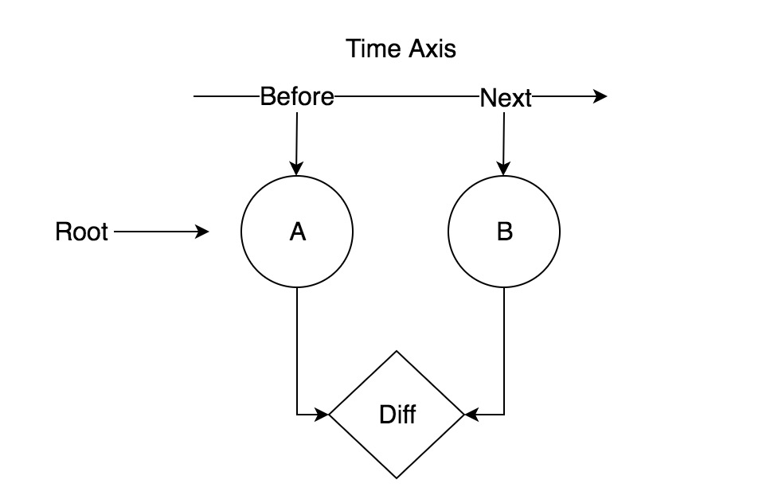
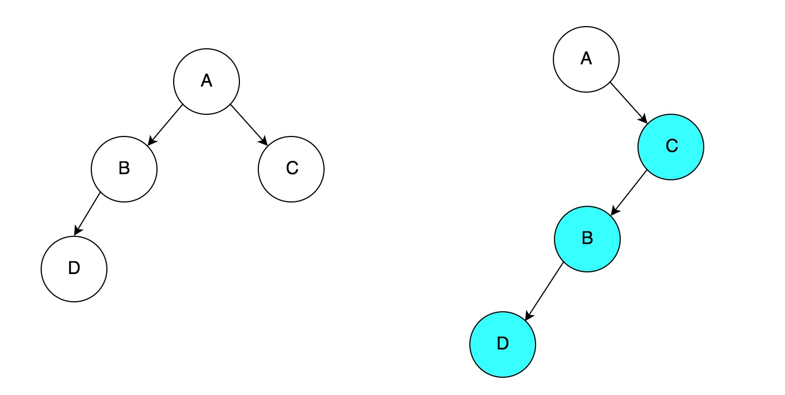
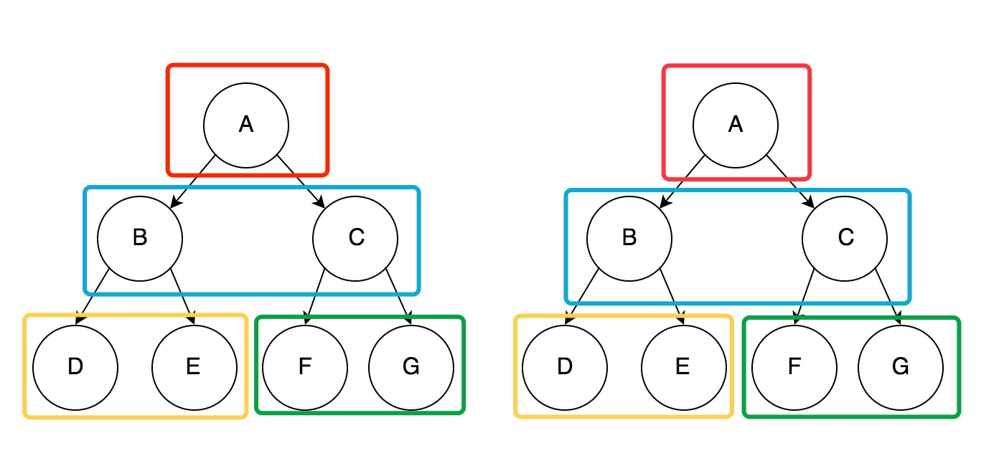
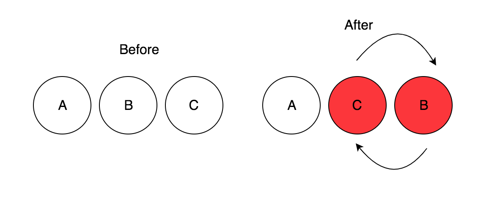
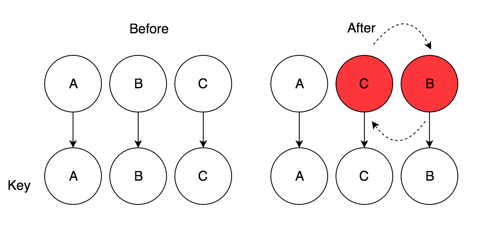

## § 2.4 React的Diff算法

### § 2.4.1 Intro

关于**React**, 估计所有开发者一听到或者一说到React想到的都是它的**Diff**, **Diff**这个东西确实是**React**的一个非常大的特点之一, 而且是整套框架的核心内容之一, 加之**virtualDOM**这一特性加持, 使得**React**的这套**Diff** + **virtualDOM**, 得以在前端领域有这样高的地位.

**Tree Diff**算法实际上并不是由**React**引入的, 但是为何**React**的**Diff**会如此名声在外? 由于**React**将传统**O(n^3)**的时间复杂度给下降到了**O(n)**的时间复杂度. 试想一下, 如果是按照传统的时间复杂度, <u>**100**</u>个节点可就是**<u>1000000</u>**次的比较, 而**React**的**Diff**算法只需要**<u>100</u>**次, 对于客户端来说, **O(n^3)**的时间复杂度的**Diff**显然是不可接受的(再加之JS的运行速度并不比得上更底层的语言).


### § 2.4.2 React Tree Diff 与传统 Diff 的不同之处

策略: 


> * Web UI 中 DOM 节点跨层级的移动操作特别少，可以忽略不计
> * 拥有相同类的两个组件将会生成相似的树形结构，拥有不同类的两个组件将会生成不同的树形结构
> * 对于同一层级的一组子节点，它们可以通过唯一 id 进行区分

基于以上三个点, 所以整个**Tree Diff** 可以用很简单的方法来实现


#### 1) 对于上下层级关系来比对: 

* ##### 当做**Diff**的时候, **React**会首先比对前后时间根节点的**Elements** 



```jsx
<!-- Elements Of Different Types -->
<!-- Before -->
<div>
  <Counter/>
</div>

<!-- After --> 

<span>
  <Counter/>
</span>

<!-- Seperator --> 

div.destory();
Counter.destory();
let span = new Span();
let counter = new Counter();
span.append(counter)
```

像上述情况, 虽然`Counter`并没有经历任何变动, 但是它的父节点从`div`变成了`span`, 所以`Counter`会先被卸载之后再被挂载进新的父节点中.

关于**React**的**DOM Tree**的**Diff**: (PS: 相同颜色的节点进行比较)


**React**的比对策略, 同级与同级比对, 如果比对结果为**false**, 那么由这个节点将被卸载之后重新**mount**进**DOM Tree.** 

比如: 




按照常规 Diff 的方法


```typescript
// 伪代码
A.removeChild(B);
C.appendChild(B);
```

    React的Diff策略算法: 

```typescript
// Unmounting phase
A.removeChild(B);
B.destory();
D.destory();
// Re-mounting phase
let newB = new BComponent();
new CComponent().appendChild(newB.appendChild(new DComponent()));
```

根据这个过程, 再结合之前生命周期, 可以得出以下调用栈: (如果感兴趣可以去自己尝试在代码里做实验, 给生命周期函数里加上log, 来观察具体调用栈)


```typescript
// interaction trigger update
A.componentWillUpdate();

B.ComponentWillUnmount();
D.ComponentWillUnmount();

new CComponent();
newC.componentWillMount();
new BComponent();
newB.componentWillMount();
new DComponent();
newD.componentWillMount();

C.componentWillUnmount();

newD.componentDidMount();
newB.componentDidMount();
newC.componentDidMount();
A.componentDidUpdate();
// update over
```

我写了一个例子: [Example.js](./Example.js), 通过例子的运行结果可以看到以下log

```javascript
A Will Update
B Will Unmount
D Will Unmount
C created
C Will Mount
B created
B Will Mount
D created
D Will Mount
C Will Unmount
D Did Mount
B Did Mount
C Did Mount
A Did Update
```

通过这个log和运行过程可以看到, `C` `B` `D` 三个节点并非是被单纯的移动, 而是先被注销之后, 再重新生成过去, 这一过程实际的开销是比较大的. 所以, 在维护应用时, 要想进一步的提高应用性能.


> 尽可能保有原有的DOM结构, 转而采用CSS的方法来做与之对应的相同的效果(显示或隐藏节点), 会减少一系列不必要的开销, 因为在开始也就说过, 对象的开辟和销毁的开销是很大的. 

接下来关注一下, 同级元素的比对.


#### 2) 对于同级关系比对:

#####   1. 组件比对 (Component Diff) :

> React 是基于组件构建应用的，对于组件间的比较所采取的策略也是简洁高效。
>
> - 如果是同一类型的组件，按照原策略继续比较 virtual DOM tree.
> - 如果不是，则将该组件判断为 dirty component，从而替换整个组件下的所有子节点.
> - 对于同一类型的组件，有可能其 Virtual DOM 没有任何变化，如果能够确切的知道这点那可以节省大量的 diff 运算时间，因此 React 允许用户通过 shouldComponentUpdate() 来判断该组件是否需要进行 diff.



按照这种情况, C和G的结构实际上是相似的, 根据上述描述, `C, E, F`组件会被整个卸载掉 重新生成`G` `E` `F` 组件, 而并非简单的通过`C -> G`这种替换.


#####   2. 相同类型的DOM元素的比对(DOM Elements Of The Same Type) :

> When comparing two React DOM elements of the same type, React looks at the attributes of both, keeps the same underlying DOM node, and only updates the changed attributes. For example:

```jsx
<div className="before" title="stuff" />

<div className="after" title="stuff" />

// simplely update class from before to after
// replace className 'before' -> 'after'
```

​    在之前生命周期的一部分说到过, 所有的props都会被拉出来放到一个`props`对象当中保存, 当做比对的时候, 在这个例子里的变化`className`会被标记为需要改变的`props` , **React**便会只去更新这个属性

当变更style这个属性的时候会有一些不同, 一共有两种情况: 


1. 仅有变更

```jsx
<div style={{color: 'red', fontWeight: 'bold'}} />

<div style={{color: 'green', fontWeight: 'bold'}} />

// simplely update color from red to green
// replace style.color 'red' -> 'green'
```

2. 有属性的删除和添加

```jsx
<div style={{color: 'red'}} />

<div style={{fontWeight: 'bold'}} />
// firstly delete style.color, and add style.fontWeight = 'bold';
// delete style.color
// add style.fontWeight = 'bold'
```


#####  3. 子节点递归 (Recursing of Children):

> By default, when recursing on the children of a DOM node, React just iterates over both lists of children at the same time and generates a mutation whenever there’s a difference.

在**React**的源码里`validateExplicitKeys`方法中有这样一段警告, 很多刚开始使用React的同学也肯定遇到过, **React**警告用户, 要为<u>列表节点(List Node)</u>的成员提供一个<u>**Key**</u>属性. 那么这个<u>**Key**</u>属性, 到底扮演一个怎么样的角色呢? 


```typescript
'Each child in an array or iterator should have a unique "key" prop.' +
      '%s%s See https://fb.me/react-warning-keys for more information.%s'
```

**Key**在**React**的生态系统中扮演的角色可以如图所示


[example](https://codesandbox.io/s/x22lqwvr9q)

在没有设置**Key**的情况下: 



Log:


```Typescript
// Unmounting 
A will unmount
B will unmount.
C will unmount.

// Re-Mounting
A is created.
A will mount.
C is created.
C will mount.
B is created.
B will mount.

A did mount.
C did mount.
B did mount.
```

在设置有**Key**的情况下:

[example](https://codesandbox.io/s/1v4qxwp2n3)



此时的Log情况又是怎么样的呢? 


```typescript
A will update
C will update
B will update

A is updated.
C is updated.
B is updated.
```

从这个Log情况可以看到问题, 在没有节点增加或删除的情况下, 如果提供给节点**Key**关键字, 并不会产生多余的销毁, 开辟过程, 能够大幅的提升整体应用性能, 利用原有本身就存在的节点直接更新.  通过在**updating**的钩子函数中加入计时器来粗略观察更新时间, 该结论直接得到印证, 接下来我们可以通过源代码来查看为什么**Key**这个关键字会有这种效果.


`ReactMultiChild.js`

由于代码比较多, 便只在这展示一小部分代码


```typescript
var _updateChildren = function(
      nextNestedChildrenElements,
      transaction,
      context,
    ) {
      // 首先拿到之前的children
      var prevChildren = this._renderedChildren;
      // 构造一个需要被移除的节点的map
      var removedNodes = {};
      // 挂载的映像(markups)
      var mountImages = [];
      // mountImages在这个this_reconcilerUpdateChildren中被赋值.
      var nextChildren = this._reconcilerUpdateChildren(
        prevChildren,
        nextNestedChildrenElements,
        mountImages,
        removedNodes,
        transaction,
        context,
      );
      if (!nextChildren && !prevChildren) {
        return;
      }
      var updates = null;
```


updates 是由下面这种类型的对象组成的一个数组. 上面的方法整个所做的工作就是通过前后比较, 拿到一个上面这种格式的队列数组, 通过`processQueue`方法来处理这些更新, 对于这个更新, 一共有以下几种type:


* INSERT_MARKUP  插入标签
* MOVE_EXISTING 移动现有的标签
* SET_MARKUP 重设标签
* TEXT_CONTENT 更改文本
* REMOVE_NODE 删除节点

然后`processQueue`这个方法, 根据拿到的这个type来选择具体做哪一种DOM操作.

#### § 2.4.3 VirtualDOM 和 Diff到底是如何结合并产生奇效的?

##### 1. 为何高效

首先需要来看一张图片, 有关于浏览器的工作原理: 


图片来自 **Mozilla — <https://developer.mozilla.org/en-US/docs/Introduction_to_Layout_in_Mozilla**>

1. 首先是HTML由请求返回, 递交给Parser (Parser是一个单线程的引擎, 和JS引擎是互斥的), 这里CSS的Parser和HTMLParser并不是同一线程
2. Parser解析出来的Content会被抽出来变成我们熟悉的DOM, 把DOM + Style Rules —> FrameConstructor(GUI线程)
   * 解析, 计算样式, 渲染, 重复一过程.
3. 当整个过程结束, 我们的网页就以我们想要的方式呈现在眼前了, 但是由于拥有用户交互, 网页不可能永远保持原样, 这个时候浏览器接收到了交互指令并且DOM(ContentModel)变化.
   *  浏览器会去计算新的HTML结构
   *  根据指令改变, 然后把DOM结构更新
   *  重新绘制


当**DOM**结构变更时, **DOM**被表示为树形结构, 更新**DOM**对象这个速度是很快的, 但是页面的重绘过程相对这个操作来说要慢很多, **React**所做的工作就是通过他的比对操作, 让更新操作变成批量更新(**Batching Update**).

由于页面的重绘(**Repaint**)这个操作比较缓慢, VirtualDOM就是通过减少重绘操作来提高应用性能的, 而它能够减少重绘的能力, 就是基于**Diff**. 通过**Diff**从**VirtualDOM**中找出来需要更新的那些节点, 然后通过批量操作更新. 接下来让我们来完整的走一遍这个操作.


##### 2. 原理: 

首先通过一段非常简单的代码


**DOMStructure**


```html
<!-- DOM Structure -->
<div id="root">
  <div data-reactroot="" style="text-align: center; margin-top: 100px;">
    <button> Click me to change the paragraph</button>
    <h1>I am the paragraph</h1>
  </div>
</div>
```

当我们点击`button`时, 会触发下面这段代码


```typescript
var clickHdl = () => {
                this.setState({
                    paragraph: "I am the paragraph that changed"
                }
```

点击`button`之后, setState被调用, 此刻便进入更新阶段: 

当`setState`调用之后, **Paragraph**这个**Component**会被标记为一个**DirtyComponent**,  在之前的[生命周期](https://github.com/JeremyWuuuuu/ReactSourceCodeNote/blob/master/Chapter2/Chapter%20%C2%A72.1%20%E7%94%9F%E5%91%BD%E5%91%A8%E6%9C%9F.md#1-voidsetstate)一章中说到了

```typescript
// 这里代码并非真实代码, 为了方便阅读, 所以我做了一点转义
dirtyComponent.push(Paragraph);
Paragraph._pendingStateQueue.push({paragraph: "I am the paragraph that changed"});
```


当被标记为**DirtyComponent**之后就进入到我们熟悉的[事务操作](https://github.com/JeremyWuuuuu/ReactSourceCodeNote/blob/master/Chapter2/Chapter%20%C2%A72.2%20%E4%BA%8B%E5%8A%A1%E5%A4%84%E7%90%86.md)环节了, 通过事务调用的`runBatchedUpdates()`方法, 当**_pendingStateQueue**不为<u>**null**</u>时, 便会调用类方法`updateComponent`

```typescript
transaction.perform(runBatchedUpdates, null, transaction);
// performUpdateIfNessary
this._pendingStateQueue === [{paragraph: "I am the paragraph that changed"}]; // true
if (this._pendingStateQueue !== null || this._pendingForceUpdate) {
      this.updateComponent(
        transaction,
        this._currentElement,
        this._currentElement,
        this._context,
        this._context,
      );
```

`updateComponent`方法调用, 会去调用两个钩子函数

1. 会先去调用`componentWillRecieveProps()`方法, 此时该方法能够接收到更新的**props**和**context**.

2. 当调用完上一个方法之后, 下一时刻的**state**就已经被准备好, 然后会把准备好的**props**, **context**, **state**, 全部传入`shouldComponentUpdate()`方法当中, 来交给这个方法决定是否真的需要更新并根据返回结果设立是否更新标识符. 当标识符被设置为`true`, 紧接着就会进入下一步

3. 当`shouldUpdate`这个标识符被置为`true`之后, 就会紧接着调用组件上的`componentWillUpdate(), render(), componentDidUpdate()`三个方法. 

4. 然后**React**会调用组件上的`render`方法来进行重新渲染. 在这个`render`方法里, 就是**VirtualDOM**和**Diff**发挥作用的时候, 然后根据**Diff**算法对于**VirtualDOM**的**Diffing**结果来重新更新**DOM**节点.

   * `shouldComponentUpdate()`方法首先会把`nextElement`和`prevElement`准备好, 其中: 

   ```typescript
   // 用更新后的props, state, context来重新render
   var nextElement: ReactElement = instance.render();
   // 未更新之前的的ReactElement
   var prevElement: ReactElement = instance._renderedElement._currentElement;
   ```


   * 对比`nextElement`和`preElement`的**Children**, 然后此时**Diff**发挥作用.


**Translate From [how-virtual-dom-and-diffing-works-in-react](https://medium.com/@gethylgeorge/how-virtual-dom-and-diffing-works-in-react-6fc805f9f84e)**          

##### 3. 源码分析:

节点比对发生在`ReactChildReconciler.updateChildren()`方法中.

1. 遍历`nextChildren`, 然后通过`preChildren[name]`得到`prevChild`.

2. 判断 `(prevChild != null && shouldUpdateReactComponent(prevElement, nextElement))` 的值, 我们之前说到的**Key**关键字在这个`shouldUpdateReactComponent`就起到了至关重要的作用

   ```typescript
   // 当key 和 type 都是同一个时, 便会返回true
   return nextType === 'object' && 
     prevElement.type === nextElement.type && 
     prevElement.key === nextElement.key 
   ```

   当你对子节点设置过**Key**: 

   

   当你没有对子节点设置**Key**: 

   

   **Key**的作用就发挥在此处, 当你对子节点设置**Key**之后. 你的`children._currentElement`的键名就会和**Component**一一对应映射(**Mapping**)起来, 变成了这种格式: 

   ```typescript
   var children._currentElement = {
     [.${key}]: Co_RespondingReactComponent
   }
   ```

   假如你并未设置**Key**, 那么你的子节点便会是这种格式, 并且不会与对应的**Component**做映射, 这个映射过程, 是在**Mounting**阶段就会完成的

   ```typescript
   var children._currentElement = {
     .0: ReactComponent,
     .1: ReactComponent
   }
   ```

   ​

   * 如果判断结果是**True**则直接调用`ReactReconciler.receiveComponent()`更新对应的**Component**.
   * 当结果是**False**, 则通过`ReactReconciler.unmountComponent()`卸载原有节点, 将这个原有节点存入`removeNodes`中 然后再构造新的节点, 通过`ReactReconciler.mountComponent()`拿到挂载的HTML片段等待推入`mountImages`, 然后把新构造的**Component**存入`nextChildren`中, 等待返回.

3.  当拿到了所有的`nextChildren`之后, 然后通过比对操作, 拿到需要**添加, 删除, 更新, 换位**的节点, 然后对应去DOM更新, 在这里通过代码片段来讲一下更新的策略

   * **当两个节点相同时**

   ```typescript
   var nextIndex = 0, lastIndex = 0;
   if (prevChild === nextChild) {
     // 仅仅移动原节点, 移动之前会在这个方法里进行一个比较
     // child._mountIndex < lastIndex 如果条件成立, 则会调用moveTo方法
     this.moveChild(prevChild, lastPlacedNode, nextIndex, lastIndex);
     // 更新lastIndex, 
     lastIndex = Math.max(prevChild._mountIndex, lastIndex);
     prevChild._mountIndex = nextIndex;
   } else {
     // ... 先略过
   }
   // 当一次比对结束, nextIndex自增.
   nextIndex++;
   ```

   

   用这个图来举个例子, 此时需要将`C`和`B`的位置调换, `C`的`_mountIndex: 2`, `nextIndex: 1`, `lastIndex: 0`, 当第一次代码执行完毕之后来到循环体的第二次, 此时 `_mountIndex: 2 < 0` 为`false`, 然后`nextIndex`自增1变成2. 进入第三次循环, 此时`B._mountIndex = 1, lastIndex = 2`,  此时 `1 < 2`成立, 便会调用`moveTo `方法,  `moveTo`方法在最后调用`parentNode.insertBefore(childNode, referenceNode)` 这个原生方法来执行更新.

   * **当两个元素不同时 在对应位置插入新的节点**

   ```typescript
   if (prevChild !== nextChild) { // 这里就是上面的else 分支
     if (prevChild) {
         // Update `lastIndex` before `_mountIndex` gets unset by unmounting.
         lastIndex = Math.max(prevChild._mountIndex, lastIndex);
         // The `removedNodes` loop below will actually remove the child.
         }
     	  // 当前后两个child不一样, 便会通过这个地方, 实例化新的组件节点
     	  // 然后把它推入更新队列
         updates = enqueue(
           updates,
           this._mountChildAtIndex(
             nextChild,
             mountImages[nextMountIndex],
             lastPlacedNode,
             nextIndex,
             transaction,
             context,
           ),
         );
     	  // 
         nextMountIndex++;
   }
   ```

   * **销毁不存在的节点**

   ```typescript
   for (name in removedNodes) {
       if (removedNodes.hasOwnProperty(name)) {
         updates = enqueue(
           updates,
           this._unmountChild(prevChildren[name], removedNodes[name]),
         );
       }
     }
   ```

   * **处理队列**

   ```typescript
   processQueue(updates); //所有实际的DOM操作就在这个里面通过一个Case Match去匹配到底调用那种操作, 是移除还是添加还是换位.
   ```

4. 自此, 更新阶段结束, 应用等待下一次的更新通知.

   ​

   ​